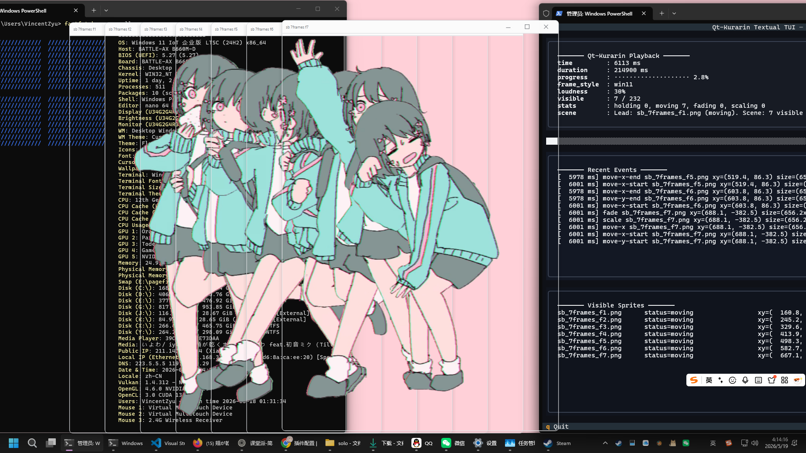
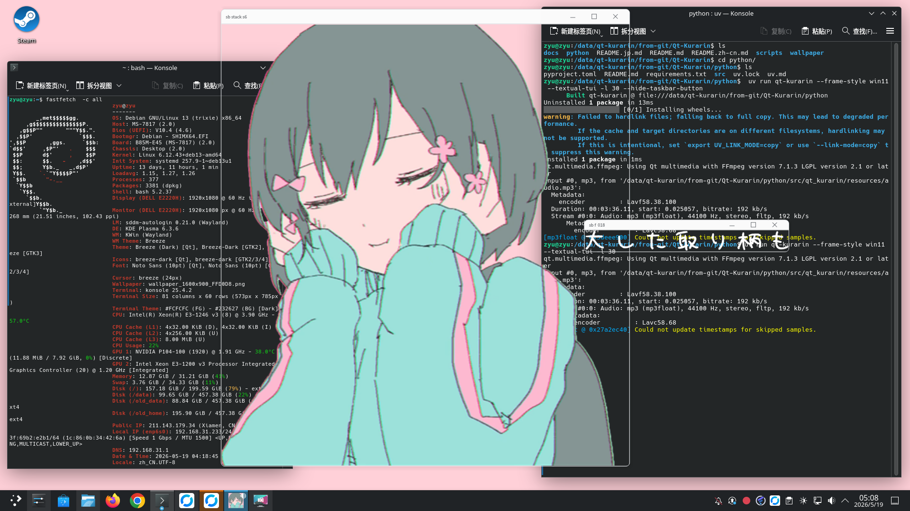
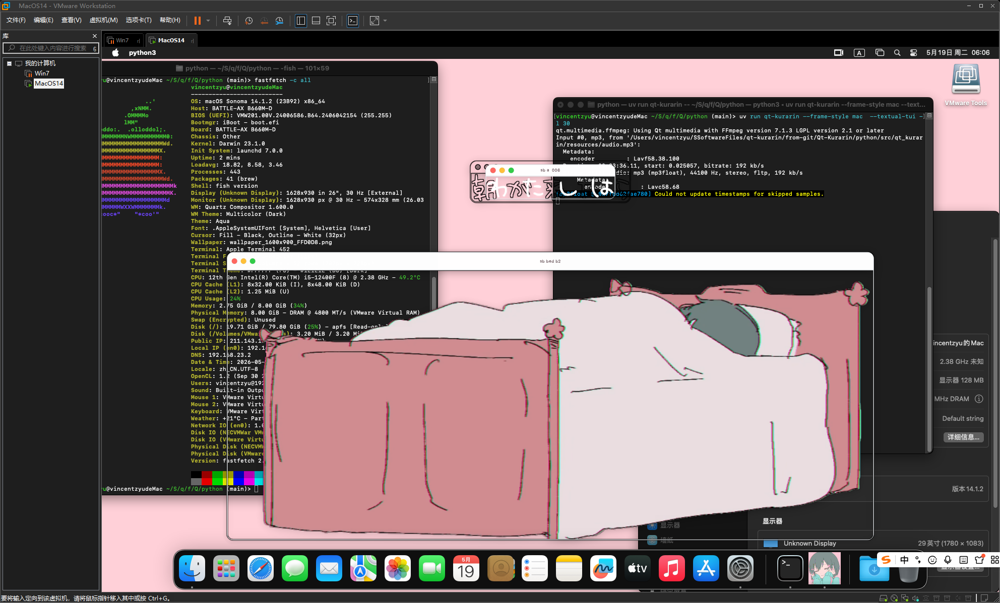

# Qt-Kurarin Python プロトタイプ

> Qt-powered Kyuukurarin (きゅうくらりん) on your desktop — animated sprites in sync with the music

> **[📖 English](README.md)**
> **[📖 简体中文(大陆)](README.zh-cn.md)**
> **[📖 日本語](README.jp.md)**

[](https://github.com/VincentZyuApps/Qt-Kurarin)
[](https://gitee.com/vincent-zyu/qt-kurarin)

[](https://pypi.org/project/qt-kurarin/)

これは PyQt6 ベースの再実装ラインであり、[元プロジェクト](https://github.com/VincentZyu233/Win-kurarin)の中核演出をデスクトップ上で検証するためのものです：

- 複数の独立したトップレベルウィンドウ
- 透過背景
- タイムライン駆動の移動アニメーション
- フェードイン / フェードアウト
- 常時最前面表示

|  |  |  |
|:-:|:-:|:-:|
| Windows 11 — `--frame-style win11` | Debian 13 + KDE Wayland | macOS 14 Sonoma |

現在のビルドで読み込むもの：

- `data/script.txt`
- `resources/audio.mp3`
- `resources/*.png`

## ソースから実行

```shell
git clone https://github.com/VincentZyuApps/Qt-Kurarin
# または Gitee からクローン（中国本土で高速）：
git clone https://gitee.com/vincent-zyu/qt-kurarin
cd Qt-Kurarin/python
uv venv --python 3.13
uv pip install -r ./requirements.txt
uv run python -m qt_kurarin.main [オプション]
```

## PyPI から実行

```shell
rm -r ./.venv/ # すでに存在する場合
uv venv --python 3.13
uv pip install qt-kurarin
# uv pip install qt-kurarin --index-url https://pypi.org/simple  # ミラーが更新されていない場合は公式ソースを試す
uv run qt-kurarin [オプション]
```

## オプション

| フラグ | 説明 | デフォルト |
|--------|------|-----------|
| `-f, --frame-style <STYLE>` | ウィンドウ枠スタイル：`none`、`win11`、`mac` | `none` |
| `-v`, `--verbose` | スプライト再生の詳細をコンソールに表示 | オフ |
| `-t`, `--textual-tui` | Textual TUI で再生詳細を表示 | オフ |
| `-n, --hide-taskbar-button` | タスクバー/ドックアイコンを非表示（Win: ✅ 確実、macOS: 🟡 非表示かも、Linux: ❓ コンポジター次第） | オフ |
| `-l`, `--loudness <0-100>` | オーディオ音量パーセント | `100` |

## 使用例

```shell
uv run qt-kurarin
uv run qt-kurarin --help
uv run qt-kurarin --frame-style win11 --textual-tui
uv run qt-kurarin --frame-style mac --verbose
uv run qt-kurarin --loudness 60
```

> 💡 壁紙を自分で生成：[`wallpaper/gen_wallpaper.py`](wallpaper/gen_wallpaper.py)
>
> 💡 壁紙画像をクリックしてフル解像度で表示、右クリックで保存。

[](wallpaper/wallpaper_1600x900_FFD0D8.png)

## プラットフォーム補足

### `--hide-taskbar-button`

各プラットフォームにおける動作の技術的解説：

**Windows** ✅ 確実。`Tool` ウィンドウフラグを設定し、Win32 API の `WS_EX_TOOLWINDOW` 拡張スタイルに相当します。タスクバーや Alt+Tab 一覧には表示されませんが、最前面表示は維持されます。

**macOS** 🟡 おそらく非表示、保証なし。`WindowStaysOnTopHint` と組み合わせるとフローティングツールパネルとして扱われ、通常は Dock アイコンが表示されません。ただし一部の macOS バージョンでは Dock に表示される場合があります。

**Linux/Wayland** ❌ ほぼ無効。Wayland コンポジターがタスクバーの動作を独立して制御するためです — KWin (KDE) は `Tool` フラグを完全に無視し、GNOME/Mutter は部分的に無視し、wlroots 系（Hyprland、Sway）も通常は無視します。

**Linux/X11** 🟡 ウィンドウマネージャー次第。KWin は `Tool` フラグを尊重しタスクバーエントリを非表示にします。GNOME/Mutter は部分的に尊重します。タイル型 WM（i3、bspwm）には従来のタスクバー概念がないため、フラグに可視効果はありません。

> 📝 本情報は経験およびオンライン調査に基づきます。実際の動作は OS バージョン、デスクトップ環境、設定によって異なる場合があります。
