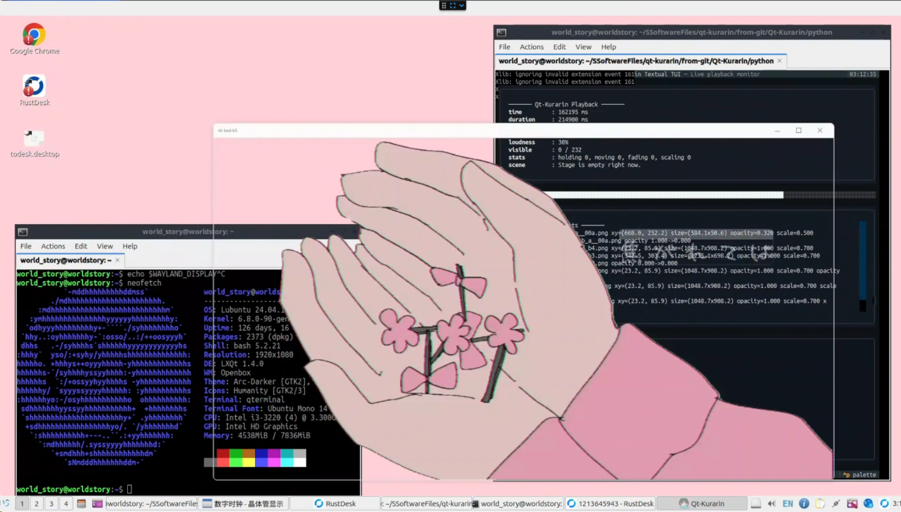

# Qt-Kurarin Python Prototype

> 🖥️ Qt-powered Kyuukurarin (きゅうくらりん) on your desktop — animated sprites in sync with the music 🎵

> **[📖 English](README.md)**
> **[📖 简体中文(大陆)](README.zh-cn.md)**
> **[📖 日本語](README.jp.md)**

[](https://github.com/VincentZyuApps/Qt-Kurarin)
[](https://gitee.com/vincent-zyu/qt-kurarin)

[](https://pypi.org/project/qt-kurarin/)
[](https://pypi.org/project/qt-kurarin/)
[](https://pypi.org/project/qt-kurarin/)

This is a PyQt6 reconstruction track for validating the core effect of the [original project](https://github.com/VincentZyu233/Win-kurarin):

- multiple independent top-level windows
- transparent backgrounds
- timeline-driven movement
- fade in / fade out
- always-on-top presentation

| Platform | Preview |
|:---|:---:|
| Windows 11 |  |
| Debian 13 + KDE Wayland |  |
| Ubuntu 24.04 + LXQt X11 |  |
| macOS 14 Sonoma |  |

The current build reads:

- `data/script.txt`
- `resources/audio.mp3`
- `resources/*.png`

## Run from source

```shell
git clone https://github.com/VincentZyuApps/Qt-Kurarin
# or from gitee: 
git clone https://gitee.com/vincent-zyu/qt-kurarin
cd Qt-Kurarin/python
# uv is recommended
# https://docs.astral.sh/uv/getting-started/installation/
# https://gitee.com/wangnov/uv-custom/releases
uv venv --python 3.13
uv pip install -r ./requirements.txt
uv run python -m qt_kurarin.main [OPTIONS]
```

## Run from PyPI

```shell
rm -r ./.venv/ # if already exist
uv venv --python 3.13
uv pip install qt-kurarin
# uv pip install qt-kurarin --index-url https://pypi.org/simple  # use official index if mirrors are not latest
uv run qt-kurarin [OPTIONS]
# qt-kurarin is also a regular Python package; run it with:
uv run python -m qt_kurarin.main [OPTIONS]
```

## Options

| Flag | Description | Default |
|------|-------------|---------|
| `-f, --frame-style <STYLE>` | Window frame style: `none`, `win11`, `mac` | `none` |
| `-v`, `--verbose` | Print live sprite playback details to the console | off |
| `-t`, `--textual-tui` | Show live playback details in a Textual TUI | off |
| `-n, --hide-taskbar-button` | Hide the taskbar/dock icon (Win: ✅, macOS: 🟡 may hide, Linux: ❓ depends on compositor) | off |
| `--fps <rate>` | Target frame rate for the animation loop | `60` |
| `-l`, `--loudness <0-100>` | Audio loudness percentage | `100` |

## Examples

```shell
uv run qt-kurarin
uv run qt-kurarin --help
uv run qt-kurarin --frame-style win11 --textual-tui
uv run qt-kurarin --frame-style mac --verbose
uv run qt-kurarin --loudness 60
```

## Wallpaper

> 💡 Generate your own wallpaper: [`wallpaper/gen_wallpaper.py`](wallpaper/gen_wallpaper.py)
> 💡 Click the wallpaper image to view full resolution, then right-click to save.
> 🎨 Wallpaper size: 1600×900 px — base color: `#FFD0D8` (soft pink)

[](wallpaper/wallpaper_1600x900_FFD0D8.png)

## Platform Notes

### `--hide-taskbar-button`

Technical breakdown of how this flag behaves across operating systems:

**Windows** ✅ Reliable. Sets the `Tool` window flag, which maps to the Win32 `WS_EX_TOOLWINDOW` extended style. The window will not appear in the taskbar or Alt+Tab list, but remains always-on-top.

**macOS** 🟡 Likely works, not guaranteed. When combined with `WindowStaysOnTopHint`, macOS treats the window as a floating utility panel, which typically lacks a Dock icon. However, on some macOS versions, a single Tool window may still appear in the Dock.

**Linux/Wayland** ❌ Unlikely to work. Wayland compositors control taskbar behavior independently — KWin (KDE) ignores the `Tool` flag entirely, GNOME/Mutter partially ignores it, and wlroots-based compositors (Hyprland, Sway) generally ignore it as well.

**Linux/X11** 🟡 Depends on the window manager. KWin respects the `Tool` flag and hides the taskbar entry. GNOME/Mutter partially respects it. Tiling WMs (i3, bspwm) have no traditional taskbar concept, so the flag has no visible effect.

> 📝 This information is based on experience and online research. Actual behavior may vary depending on your specific OS version, desktop environment, and configuration.
